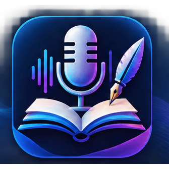
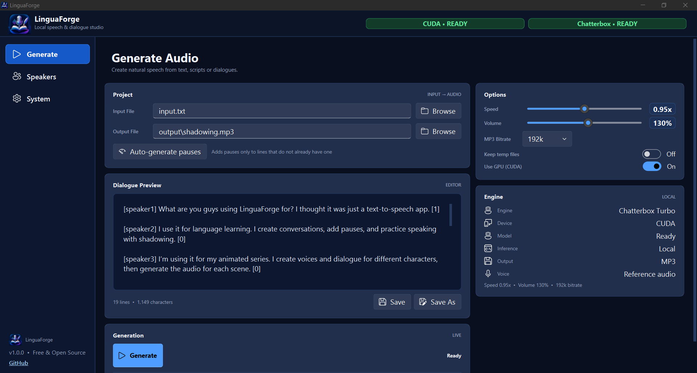
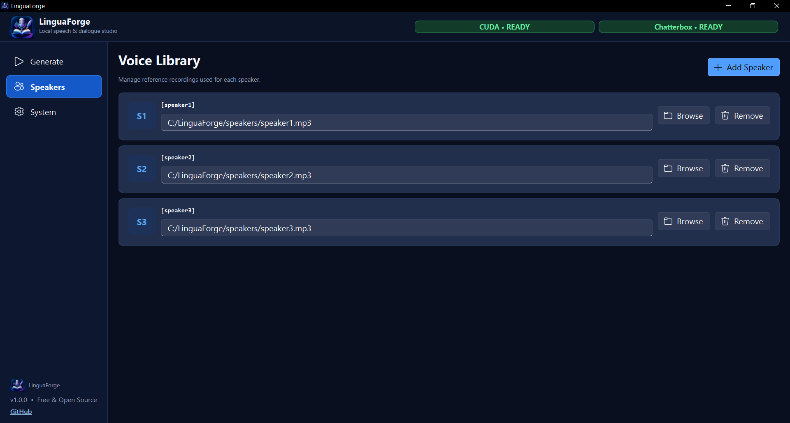
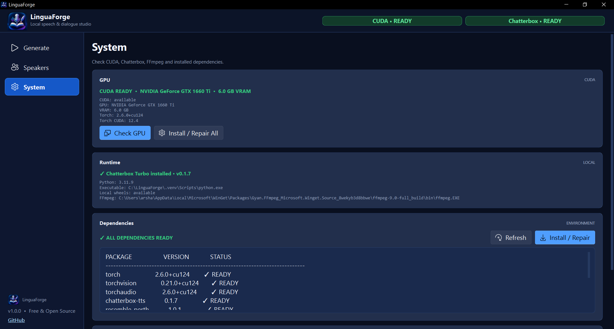
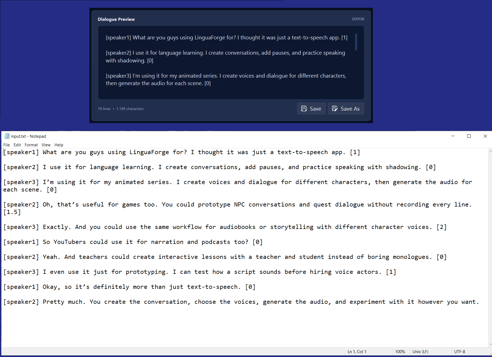

# LinguaForge

<p align="center">
  
</p>

<h1 align="center">LinguaForge</h1>

<p align="center">
  <strong>A local AI voice & dialogue studio for turning text into expressive speech, conversations, and scenes.</strong>
</p>

<p align="center">
  Build language-learning material, multi-character conversations, animation dialogue, game lines, and movie-style scenes — powered by generative AI and running locally on your machine.
</p>

<p align="center">
  <strong>Free · Open Source · Local AI · GPU Accelerated</strong>
</p>

---

## 🎙️ What is LinguaForge?

LinguaForge started with a simple idea:

> **What if generating speech could feel more like working with a script than filling out a TTS form?**

Traditional text-to-speech usually follows a very simple workflow:

```text
Text → Voice → Audio
```

LinguaForge expands that into:

```text
Text
  +
Speakers
  +
Voice References
  +
Timing & Pauses
  +
Generation Settings
        ↓
   Generative AI
        ↓
Structured Audio
        ↓
      MP3
```

The result is a **local AI-powered speech and dialogue studio** built around [Chatterbox Turbo](https://github.com/resemble-ai/chatterbox).

It is designed for people who want to experiment with generative voice technology without building their entire workflow around a paid cloud API.

---

## 🧠 AI-Integrated from the Ground Up

LinguaForge is not just a graphical wrapper around a text-to-speech command.

The application acts as the orchestration layer around a generative speech model.

It takes care of the workflow around the model:

- Script and dialogue parsing
- Speaker selection
- Local voice references
- Multi-speaker conversations
- Sentence-level pauses
- Speech-speed control
- Generation configuration
- Audio sequencing
- MP3 export
- GPU/runtime detection
- Dependency diagnostics
- First-run environment setup and repair

Conceptually:

```text
                         ┌──────────────────────┐
                         │       Your Script    │
                         │  Text / Conversation │
                         └──────────┬───────────┘
                                    │
                                    ▼
                         ┌──────────────────────┐
                         │     LinguaForge      │
                         │   Dialogue Pipeline  │
                         └──────────┬───────────┘
                                    │
                    ┌───────────────┴───────────────┐
                    │                               │
                    ▼                               ▼
             Speaker / Voice                 Timing / Pauses
                Reference
                    │                               │
                    └───────────────┬───────────────┘
                                    ▼
                         ┌──────────────────────┐
                         │   Chatterbox Turbo   │
                         │   Generative Speech  │
                         │        Model         │
                         └──────────┬───────────┘
                                    │
                                    ▼
                         ┌──────────────────────┐
                         │   Audio Composition  │
                         │      & Export        │
                         └──────────┬───────────┘
                                    │
                                    ▼
                              MP3 / Audio
```

This is what makes the project interesting: the AI model is only one part of the system. LinguaForge builds the **desktop workflow around it**.

---

# ✨ What can you do with it?

## 📚 Language Learning & Shadowing

LinguaForge was originally built with language learning in mind.

Create your own listening and shadowing material instead of depending on a fixed library of recordings.

For example:

```text
I wake up early every morning. [3]
I drink coffee before work. [2.5]
Then I go to the gym. [2]
```

You can control the speaker, speed, pauses, and output quality and generate material specifically for the way you want to practice.

Useful for:

- English shadowing
- Listening practice
- Pronunciation exercises
- Speaking drills
- Vocabulary practice
- Role-play conversations
- Custom study material

---

## 🎬 Movie, Animation & Scripted Dialogue

This is where LinguaForge starts becoming more than a TTS tool.

You can write a scene like:

```text
[speaker1] Did you see what happened? [2]

[speaker2] No. What happened? [1.5]

[speaker1] They found the car. [2]

[speaker2] Then we should leave. [3]
```

Different speakers can use different voice references.

That makes the same generation pipeline useful for:

- Movie-style dialogue
- Animation projects
- Short films
- Story prototypes
- Screenplay visualization
- Character dialogue
- Voice prototyping

Instead of generating every sentence separately and assembling everything manually in an audio editor, the conversation itself becomes the input.

---

## 🎮 Game Development & Prototyping

LinguaForge can also be useful during game development when you need temporary or prototype voice lines.

For example:

```text
[speaker1] The gate is locked. [1]
[speaker2] Try the control panel. [1.5]
[speaker1] It's not responding. [2]
```

Potential uses include:

- NPC dialogue
- Quest conversations
- Cutscene prototypes
- Character interactions
- Interactive dialogue systems
- Rapid voice prototyping

It can help answer an important development question early:

> **"What does this scene actually sound like?"**

before committing to a final voice-production workflow.

---

# 🎙️ Multi-Speaker Voice Generation

Create multiple speakers and assign local reference audio to them.

Example:

```text
[speaker1] Hey, are you ready? [2]
[speaker2] Almost. Give me a minute. [1.5]
[speaker1] Sure. [2]
```

If a multi-speaker configuration exists but a line has no speaker tag, LinguaForge can fall back to the configured default speaker instead of unnecessarily breaking the generation workflow.

---

# ⏱️ Dialogue Timing & Pauses

Pause values can be attached directly to lines:

```text
[speaker1] Hello. [3]
```

Conceptually:

```text
Generate "Hello."
        ↓
Wait 3 seconds
        ↓
Continue
```

Decimal pauses are supported too:

```text
[speaker2] Give me a second. [1.5]
```

Lines without an explicit pause can use the application's default pause behavior rather than being silently discarded.

---

# 🔊 MP3 Export

Generated audio can be exported as MP3 with selectable bitrate:

| Bitrate | Typical use |
|---|---|
| 128 kbps | Smaller files |
| 160 kbps | General listening |
| 192 kbps | Good balance |
| 256 kbps | Higher-quality export |
| 320 kbps | High-bitrate MP3 |

The selected bitrate is applied to the actual export pipeline rather than being merely a UI preference.

---

# ⚡ Local GPU-Accelerated AI

LinguaForge is designed for local GPU inference.

The tested environment uses:

```text
PyTorch       2.6.0+cu124
TorchVision   0.21.0+cu124
TorchAudio    2.6.0+cu124
Chatterbox    0.1.7
```

A compatible NVIDIA GPU with CUDA support is recommended for practical generation performance.

The project has been tested with an:

```text
NVIDIA GeForce GTX 1660 Ti
6 GB VRAM
```

Your actual generation performance will depend on your GPU, available VRAM, system configuration, and workload.

---

# 🔒 Local First

One of LinguaForge's core ideas is simple:

> **The AI should run on your machine.**

Once the environment and required model assets are installed, the core generation workflow does not depend on a paid speech-generation API.

Your workflow can therefore look like:

```text
Your Computer
│
├── LinguaForge
├── Chatterbox Turbo
├── PyTorch
├── CUDA
├── Local Voice References
└── Generated Audio
```

This makes LinguaForge useful for experimentation, development, education, and private local workflows.

---

# 🖥️ Screenshots

> Add your screenshots to `docs/screenshots/`.

### Generate



### Speakers



### System



### Dialogue



### Demo

A short GIF or video showing the complete workflow would work especially well here:

```text
docs/demo.gif
```

```markdown

```

---

# 🚀 Installation

## Windows

LinguaForge is currently designed for Windows.

### Requirements

- Windows
- Python 3.11
- NVIDIA GPU with CUDA support recommended
- FFmpeg
- Internet connection for initial dependency/model setup

The project uses a known-good dependency combination because AI frameworks such as PyTorch, TorchAudio, TorchVision, Chatterbox, and the Perth watermarking stack are sensitive to version mismatches.

---

## 🟢 The Easy Way

The goal is to make the first-run experience as simple as possible.

On a fresh Windows installation:

```text
1. Install Python 3.11
2. Download / clone LinguaForge
3. Run setup.bat
4. Wait for setup to finish
5. Run run.bat
```

The setup process creates and prepares the project's Python environment and installs the required dependencies.

The application also includes a **System** page for environment diagnostics and installation/repair.

---

## ⚙️ Manual Setup

If you prefer to manage the environment yourself:

```powershell
py -3.11 -m venv .venv
```

Activate it:

```powershell
.venv\Scripts\activate
```

Install the dependencies:

```powershell
python -m pip install --upgrade pip
python -m pip install -r requirements.txt
```

Run:

```powershell
python run.py
```

---

# 🧩 Why are some dependencies pinned?

The project intentionally uses a known-good environment.

In particular:

```text
torch==2.6.0+cu124
torchvision==0.21.0+cu124
torchaudio==2.6.0+cu124
chatterbox-tts==0.1.7
resemble-perth==1.0.1
setuptools==80.10.2
```

The `setuptools` version is especially important because the Perth watermarking package used by Chatterbox relies on `pkg_resources` compatibility.

Blindly upgrading the environment can therefore break an otherwise working installation.

**If it works, don't randomly upgrade the AI stack.**

---

# 🧰 System & First-Run Diagnostics

LinguaForge includes a dedicated **System** page.

It is designed to make problems that would normally require opening a terminal easier to understand.

The system layer can check the environment and provide installation/repair functionality.

To avoid performing the full dependency scan on every launch, a successful environment validation can be cached.

```text
First launch
    ↓
Full environment check
    ↓
Dependencies validated
    ↓
Save runtime state
    ↓
Normal launches
    ↓
Fast startup
```

The runtime cache is local and should not be committed to Git.

---

# 🏗️ Architecture

LinguaForge is deliberately separated into layers instead of becoming one giant Python script.

At a high level:

```text
┌───────────────────────────────────┐
│            Presentation           │
│     MainWindow / Views / UI       │
└─────────────────┬─────────────────┘
                  │
┌─────────────────▼─────────────────┐
│             Services              │
│ Parsing / Generation / System     │
│ Speakers / Audio / Application    │
└─────────────────┬─────────────────┘
                  │
┌─────────────────▼─────────────────┐
│              Models               │
│ Speakers / Generation / Events    │
└─────────────────┬─────────────────┘
                  │
┌─────────────────▼─────────────────┐
│          Infrastructure           │
│ Chatterbox / PyTorch / CUDA       │
│ FFmpeg / Filesystem / Runtime     │
└───────────────────────────────────┘
```

The goal is simple:

> **The UI should not need to understand how Chatterbox, CUDA, FFmpeg, or speaker persistence actually work.**

This separation makes the application easier to extend and maintain.

For a deeper architectural explanation, see:

```text
ARCHITECTURE.md
```

---

# 📁 Project Structure

```text
LinguaForge/
│
├── app/
│   ├── models/
│   │   ├── events.py
│   │   ├── generation.py
│   │   └── speaker.py
│   │
│   ├── services/
│   │   ├── audio_generator.py
│   │   ├── dialogue_parser.py
│   │   ├── pause_service.py
│   │   ├── speaker_repository.py
│   │   └── system_service.py
│   │
│   ├── ui/
│   │   ├── generate_view.py
│   │   ├── main_window.py
│   │   ├── speakers_view.py
│   │   ├── system_view.py
│   │   ├── theme.py
│   │   └── widgets.py
│   │
│   ├── utils/
│   │   └── threading_utils.py
│   │
│   └── main.py
│
├── assets/
│   ├── linguaforge_logo.png
│   └── linguaforge_logo.ico
│
├── docs/
│   └── screenshots/
│
├── tests/
│   ├── test_dialogue_parser.py
│   └── test_pause_service.py
│
├── run.py
├── run.bat
├── setup.bat
├── requirements.txt
├── speakers.json
├── ARCHITECTURE.md
├── .gitignore
└── README.md
```

---

# 📝 Input Format

## Single Speaker

```text
I wake up early every morning. [3]
I drink coffee before work. [2.5]
Then I go to the gym. [2]
```

## Multiple Speakers

```text
[speaker1] Hey, how are you? [2]
[speaker2] I'm doing great. How about you? [2]
[speaker1] I'm good too. [2]
```

The final number represents the pause after the line.

Speaker tags are optional when the configured workflow has a default speaker available.

---

# 🎯 Design Philosophy

LinguaForge is built around a few practical principles.

### Local first

The application should remain useful without turning every generation into a paid API request.

### AI as an engine, not the entire product

The model generates the speech.

LinguaForge handles the workflow around the model.

### Structured dialogue

Conversation should be represented as data that can be parsed, processed, generated, and composed.

### Simple for users, engineered underneath

A user should not need to understand PyTorch environments, CUDA versions, or model loading just to generate a conversation.

### Stable over clever

A known-good dependency stack is more valuable than constantly chasing the newest package versions.

---

# 🧪 Testing

Run the test suite with:

```powershell
python -m pytest
```

Core areas worth testing include:

- Dialogue parsing
- Speaker selection
- Pause handling
- Default-speaker fallback
- Generation configuration
- Audio composition
- MP3 export
- Runtime/dependency detection

A good development loop is:

```text
Change
  ↓
Test
  ↓
Run application
  ↓
Test affected workflow
  ↓
Check System page
  ↓
Commit
```

---

# 🤝 Contributing

Contributions are welcome.

If you want to improve LinguaForge:

1. Fork the repository.
2. Create a focused branch.
3. Make the change.
4. Add or update tests where appropriate.
5. Run the application and test the affected workflow.
6. Open a pull request explaining what changed and why.

For larger architectural changes, explain the reasoning before modifying multiple layers.

---

# 🛣️ Roadmap

LinguaForge is still evolving.

Possible future directions include:

- More language support
- More generation backends
- Better dialogue editing
- Richer timeline/audio controls
- More advanced voice management
- Additional export formats
- Improved GPU/runtime diagnostics
- More automation around scripted production
- Better tooling for language-learning workflows
- More AI-assisted features around script and dialogue preparation

The goal is not to turn LinguaForge into a complicated DAW.

The goal is to make **AI-generated dialogue ridiculously easy to build locally.**

---

# ⚠️ Current Scope

LinguaForge is currently focused on **English speech generation** because that is the language around which the current generation pipeline and project workflow have been tested.

Support for additional languages depends on the capabilities and limitations of the underlying speech model and the quality of the required voice references.

---

# 🔐 Privacy & Voice References

LinguaForge is designed around local processing.

Voice-reference files are used by the local generation workflow and should be treated as user-provided audio assets.

Only use voice recordings that you have the right or permission to use, especially when creating or distributing generated audio.

---

# 📦 What should NOT be committed?

The repository should not contain:

- `.venv/`
- Python bytecode
- generated MP3 files
- runtime caches
- downloaded model weights
- `.whl` files
- temporary files
- IDE metadata
- local configuration containing secrets

The project `.gitignore` is intended to keep these out of version control.

---

# 📄 License

Add a `LICENSE` file before publishing the repository if you want to formally define how others may use, modify, and redistribute LinguaForge.

Also review the licenses of LinguaForge's dependencies and the terms of any model or voice technology used by the project.

---

# ❤️ Why LinguaForge?

Because local AI does not have to mean command lines, Python environments, model folders, and a collection of scripts held together with duct tape.

The idea behind LinguaForge is to take powerful generative speech technology and wrap it in an actual creative workflow:

```text
Write
  ↓
Choose speakers
  ↓
Set timing
  ↓
Generate
  ↓
Listen
  ↓
Export
```

Whether you're practicing a language, prototyping a game, writing a scene, building an animation, experimenting with AI voices, or simply curious about what local generative speech can do, LinguaForge gives you a place to start.

---

<p align="center">
  <strong>Write the dialogue. Choose the voices. Let the AI speak.</strong>
</p>

<p align="center">
  <sub>LinguaForge — Local AI speech generation, built for creators.</sub>
</p>
